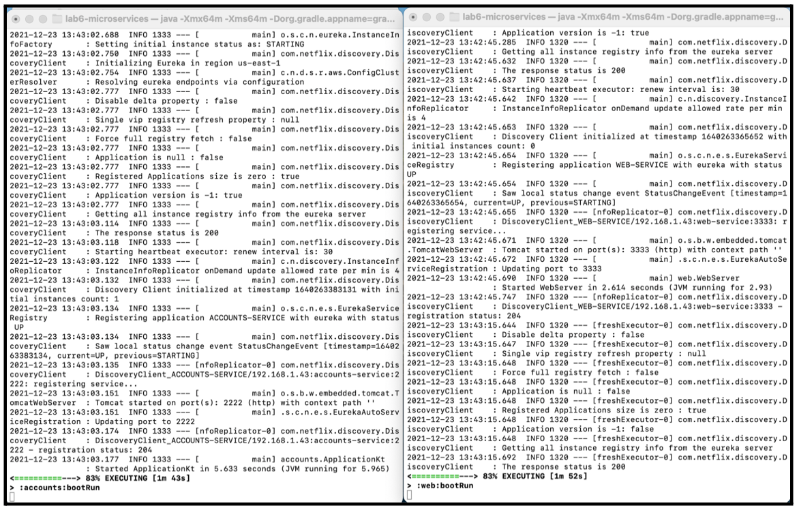
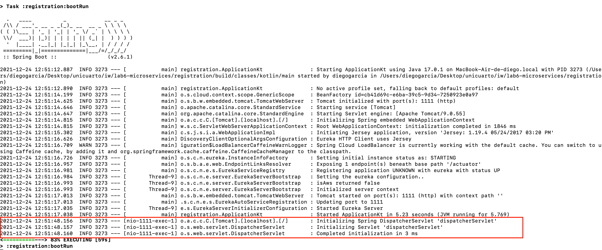
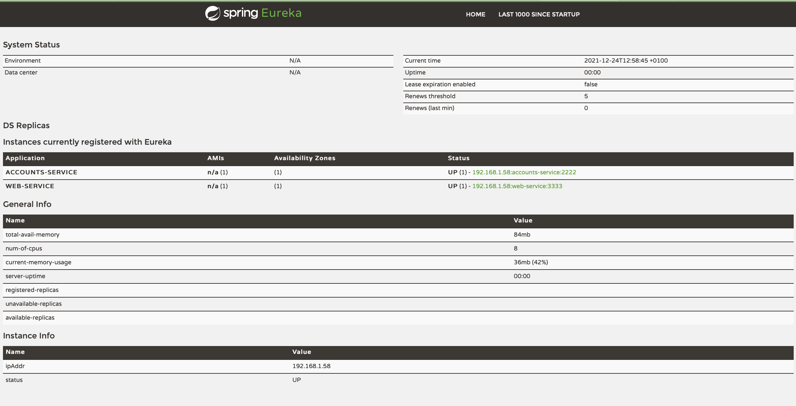
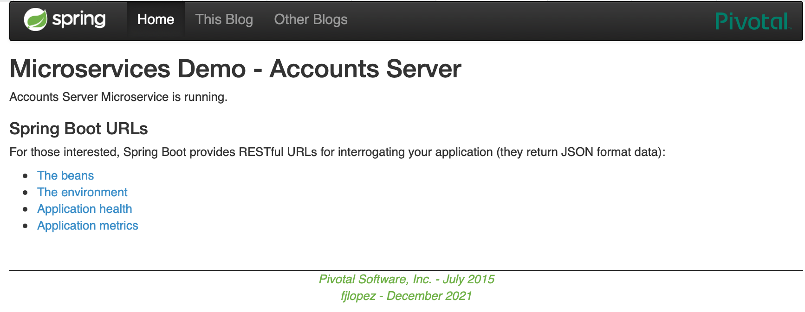
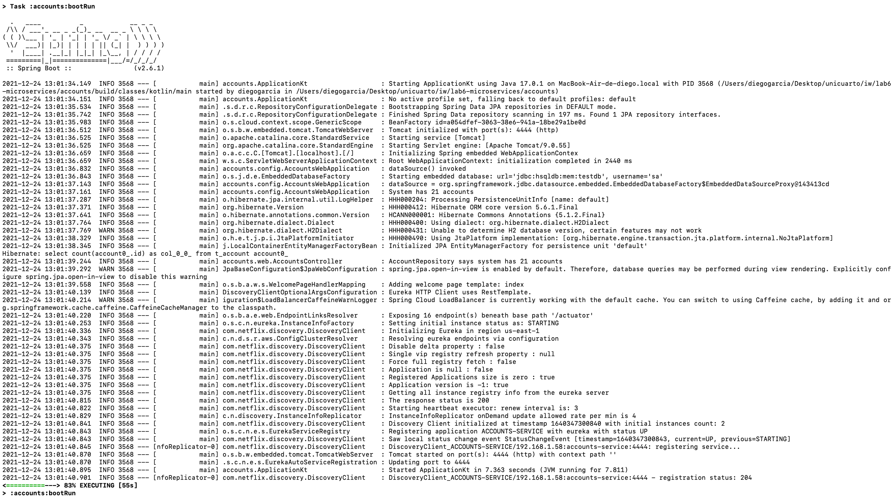
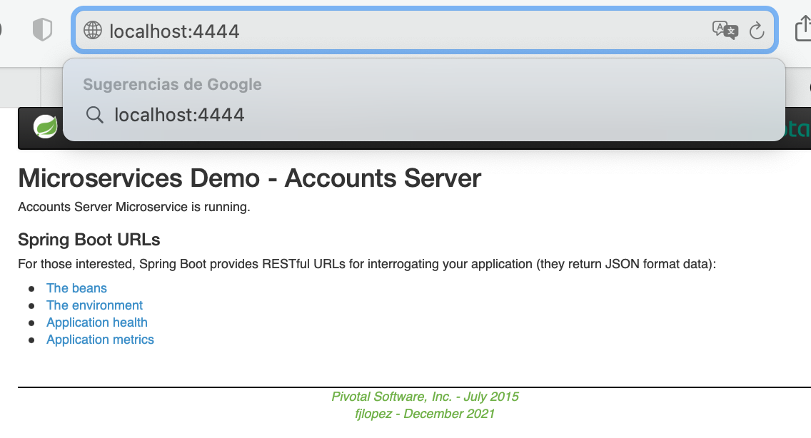
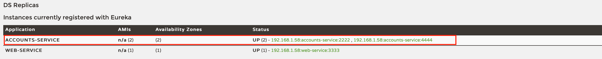
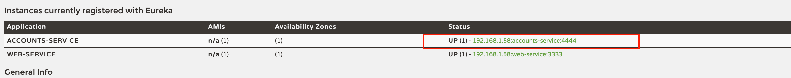
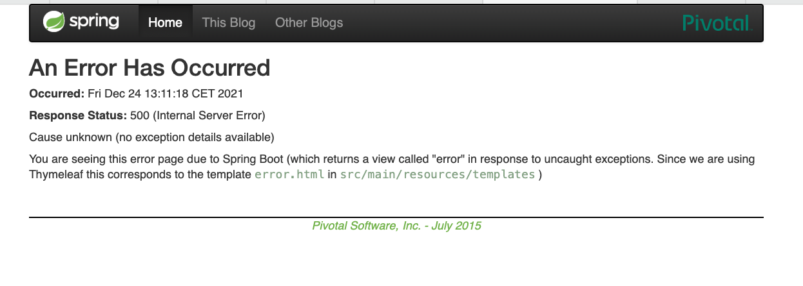
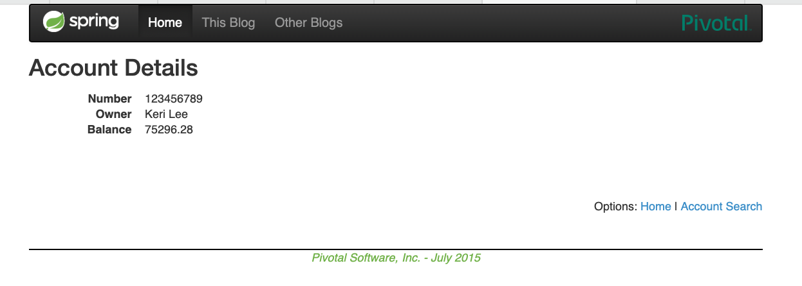

# REPORT
##1.**The two services accounts (2222) and web are running and registered (two terminals, logs screenshots).**

We launch first the registration service, then we can run web service or account service, indifferently.

The commands used for this are the following:
```
./gradlew :registration:bootrun
./gradlew :web:bootrun
./gradlew :accounts:bootrun
```


Now we can see the logs, in which we can see that  account and web services have been automatically registered:



##2. **The service registration service has these two services registered (a third terminal, dashboard screenshots).**



Now the registration service has two services registered so we can access the Eureka dashboard to check their status:


We can access to the account repository through port 2222.



We can access the MVC front-end for the accounts application through port 3333:


##3. **A second accounts service instance is started and will use the port 4444. This second accounts (4444) is also registered (a fourth terminal, log screenshots).**

We can change the server port to 4444 in the application.yml file which is in the /lab6-microservices/accounts/src/main/resources directory. This action allows a new account service to run in that port:



If we navigate to the url <https://localhost:4444> we can see the following page:



Checking the new account service in the Eureka dashboard. We can see two account services registered.



##4. **What happens when you kill the service accounts (2222) and do requests to web?**

When we kill the service it disappears from Eureka dashboard, because it disappears too from the corresponding service:



##5. **Can the web service provide information about the accounts again? Why?**

When it crashes web service response status 500, which indicates that the server encountered an unexpected condition preventing it from completing the request:



After a while, Eureka realizes that the service is down and reconfigures itself to return account information again without sending internal server error 500.



It works because Eureka acts as a mediator between the web service and the account service. When requesting an account from the web server, the web server asks Eureka where the account's service is located, as it does not have a direct path to that server.
